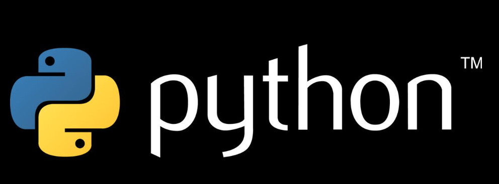

# PythonHub & CodeDriver[牧码南山Python团队]

​  ​

​

​​​

---

现负责人员[2023 第六届]：👩‍💻李茹宣[^Profile^](https://github.com/LeeXxxddd)，👨‍💻卢毅[^Profile^](https://github.com/yinjiuzui)，👨‍💻刘恩宇[^Profile^](https://github.com/Liuenyu688)，👨‍💻喻文磊[^Profile^](https://github.com/XGZ-cyber)；

往届负责人：

* 2022 第五届：

  🧑‍💻余福胜；

---

持续更新 ...
